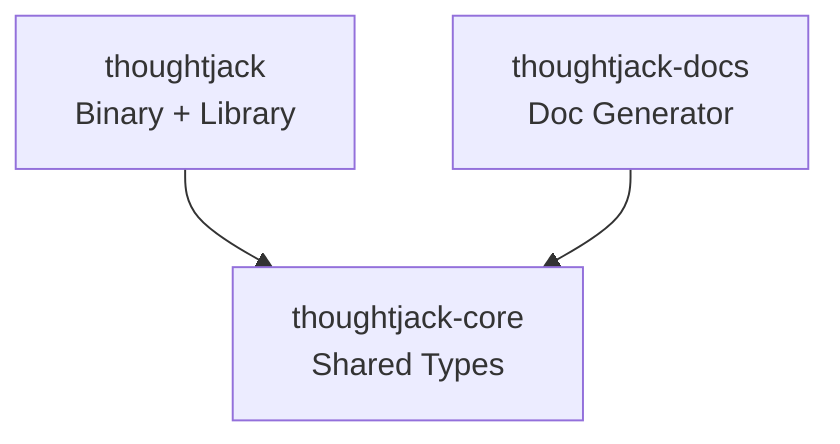
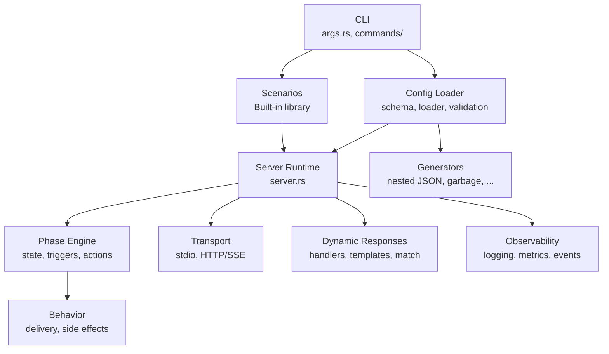
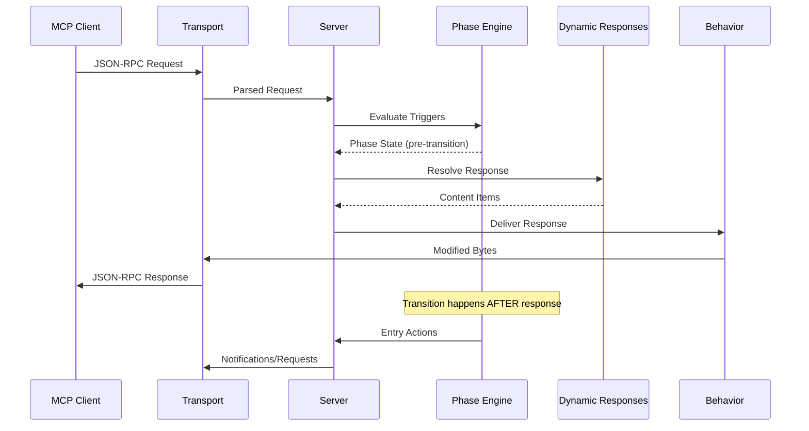

# Architecture

ThoughtJack is a Rust workspace with three crates that together implement an adversarial MCP server for security testing.

## Workspace crates

| Crate | Type | Purpose |
|-------|------|---------|
| `thoughtjack` | bin + lib | Main binary with server runtime, CLI, and all modules |
| `thoughtjack-core` | lib | Configuration schema and shared types (optional `clap` feature) |
| `thoughtjack-docs` | lib | Documentation site generation from scenario metadata |

The `thoughtjack-core` crate is split out so that `thoughtjack-docs` can read configuration schemas without depending on the full server runtime.

## Module architecture

### CLI (`cli/`)

Parses command-line arguments using Clap derive mode. Routes to command handlers for `server`, `scenarios`, `diagram`, `docs`, `completions`, and `version`.

### Config (`config/`)

Loads YAML configuration files, resolves directives (`$include`, `$file`, `$generate`, `$handler`), substitutes environment variables, and validates the result. The schema types live in `thoughtjack-core`.

### Phase engine (`phase/`)

Implements the state machine that drives temporal attacks. Key components:

- **State** — atomic phase index using `AtomicU64` for lock-free concurrent access
- **Triggers** — event-count, time-based, and content-matching trigger evaluation
- **Actions** — entry actions (notifications, requests, logging) fired on phase transitions

### Transport (`transport/`)

Abstracts the communication channel between ThoughtJack and MCP clients:

- **stdio** — JSON-RPC over stdin/stdout, single connection
- **HTTP** — Axum-based HTTP server with SSE for server-to-client messages, multi-connection

### Dynamic responses (`dynamic/`)

The dynamic response pipeline processes tool calls through several stages:

1. **Match** — evaluate conditional `when` blocks against arguments
2. **Sequence** — select the next response in a sequence
3. **Handler** — call external HTTP or command handlers
4. **Template** — interpolate `${...}` variables and functions

### Generators (`generator/`)

Factory objects that produce attack payloads lazily at response time. Each generator implements the `PayloadGenerator` trait. Large payloads (> 1 MB) use streaming via `PayloadStream`.

### Behavior (`behavior/`)

Controls response delivery and side effects:

- **Delivery** — how bytes are transmitted (slow loris, unbounded line, etc.)
- **Side effects** — additional actions (notification flood, pipe deadlock, etc.)
- **Coordinator** — resolves effective behavior from the scoping chain

### Scenarios (`scenarios/`)

10 built-in attack scenarios embedded at compile time via `include_str!`. Supports listing, detail display, fuzzy name matching, and direct execution via `--scenario`.

### Observability (`observability/`)

- **Logging** — tracing-subscriber with human and JSON formatters
- **Metrics** — Prometheus counters, gauges, and histograms (16 metrics)
- **Events** — structured JSONL event stream for post-run analysis

## Data flow

The key invariant is **response before transition**: the response to a triggering request uses the pre-transition state. Entry actions (notifications, logging) fire after the response is sent.

## Concurrency model

- **Async runtime**: Tokio multi-threaded runtime
- **Phase state**: `AtomicU64` for the phase index, `DashMap` for per-connection state
- **Side effects**: Spawned as independent Tokio tasks, managed by `SideEffectManager`
- **Shutdown**: Cooperative via `CancellationToken` (tokio-util)

## Key design decisions

**Lazy generator evaluation**: Generators create lightweight factory objects at config load time. Actual payload bytes are produced at response time. This keeps startup fast and memory usage predictable.

**Atomic phase state**: Using `AtomicU64` instead of a mutex for the phase index enables lock-free reads in the hot path (every request checks the current phase).

**Embedded scenarios**: Built-in scenarios are compiled into the binary via `include_str!`. This eliminates runtime file I/O and makes the binary self-contained.

**Transport abstraction**: The `Transport` trait abstracts stdio and HTTP, so the server runtime doesn't need to know which transport is active. Side effects that are transport-specific (e.g., `pipe_deadlock` for stdio only) check compatibility at runtime.
