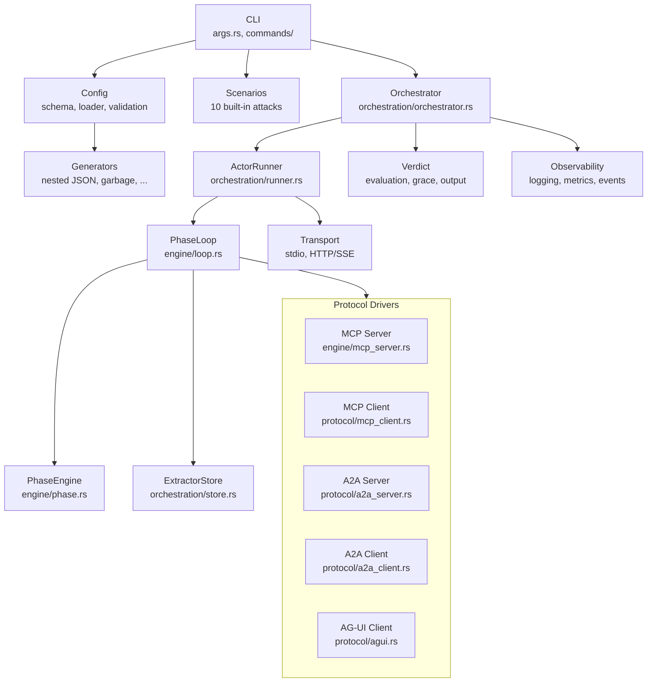
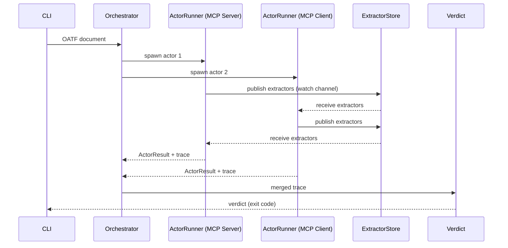

# Architecture

ThoughtJack is a monolithic Rust crate that implements an adversarial agent security testing tool. It supports multiple protocols (MCP server/client, A2A server/client, AG-UI client), multi-actor orchestration, and verdict-based evaluation.

## Module architecture

```mermaid
graph TD
    CLI[CLI<br/>args.rs, commands/] --> Config[Config<br/>schema, loader, validation]
    CLI --> Scenarios[Scenarios<br/>10 built-in attacks]
    CLI --> Orchestrator[Orchestrator<br/>orchestration/orchestrator.rs]
    Orchestrator --> ActorRunner[ActorRunner<br/>orchestration/runner.rs]
    ActorRunner --> PhaseLoop[PhaseLoop<br/>engine/loop.rs]
    PhaseLoop --> PhaseEngine[PhaseEngine<br/>engine/phase.rs]
    PhaseLoop --> Drivers
    subgraph Drivers[Protocol Drivers]
        MCP_S[MCP Server<br/>engine/mcp_server.rs]
        MCP_C[MCP Client<br/>protocol/mcp_client.rs]
        A2A_S[A2A Server<br/>protocol/a2a_server.rs]
        A2A_C[A2A Client<br/>protocol/a2a_client.rs]
        AGUI[AG-UI Client<br/>protocol/agui.rs]
    end
    PhaseLoop --> ExtractorStore[ExtractorStore<br/>orchestration/store.rs]
    Orchestrator --> Verdict[Verdict<br/>evaluation, grace, output]
    Config --> Generator[Generators<br/>nested JSON, garbage, ...]
    ActorRunner --> Transport[Transport<br/>stdio, HTTP/SSE]
    Orchestrator --> Observability[Observability<br/>logging, metrics, events]
```

### CLI (`cli/`)

Parses command-line arguments using Clap derive mode. Routes to command handlers for `run`, `validate`, `scenarios`, and `version`.

### Config (`config/`)

Loads YAML configuration files, resolves directives (`$include`, `$file`, `$generate`, `$handler`), substitutes environment variables, and validates the result.

### Engine (`engine/`)

The v0.5 core engine. Key components:

- **PhaseEngine** — the state machine that tracks phase index and evaluates triggers
- **PhaseLoop** — owns the event loop: trace append, extractor capture, trigger evaluation, phase advancement. Generic over `PhaseDriver`.
- **PhaseDriver** trait — implemented by each protocol driver. Handles protocol I/O and emits `ProtocolEvent`s.
- **GenerationProvider** — handles `$generate` and synthesize output validation

### Orchestration (`orchestration/`)

Multi-actor coordination:

- **Orchestrator** — spawns `ActorRunner` tasks (one per actor in the OATF document), collects results
- **ActorRunner** — creates a `PhaseLoop<SpecificDriver>` based on the actor's mode
- **ExtractorStore** — `DashMap`-based shared state for cross-actor extractor publication
- **SharedTrace** — append-only trace buffer merged across actors for verdict evaluation

### Protocol drivers (`protocol/`, `engine/mcp_server.rs`)

Each protocol mode has a driver implementing the `PhaseDriver` trait:

| Driver | Mode | Location |
|--------|------|----------|
| MCP server | `mcp_server` | `engine/mcp_server.rs` |
| MCP client | `mcp_client` | `protocol/mcp_client.rs` |
| A2A server | `a2a_server` | `protocol/a2a_server.rs` |
| A2A client | `a2a_client` | `protocol/a2a_client.rs` |
| AG-UI client | `agui_client` | `protocol/agui.rs` |

### Verdict (`verdict/`)

Post-execution evaluation pipeline:

- **Grace period** — configurable wait after execution for delayed effects
- **Indicator evaluation** — CEL expressions and semantic (LLM-as-judge) checks
- **Verdict computation** — `exploited`, `not_exploited`, `partial`, `error`
- **Output** — JSON verdict file and human-readable summary

### Transport (`transport/`)

Abstracts the communication channel:

- **stdio** — JSON-RPC over stdin/stdout, single connection
- **HTTP** — Axum-based HTTP server with SSE for server-to-client messages, multi-connection

### Generators (`generator/`)

Factory objects that produce attack payloads lazily at response time. Each generator implements the `PayloadGenerator` trait. Large payloads (> 1 MB) use streaming via `PayloadStream`.

### Behavior (`behavior/`)

Controls response delivery and side effects:

- **Delivery** — how bytes are transmitted (slow loris, unbounded line, etc.)
- **Side effects** — additional actions (notification flood, pipe deadlock, etc.)

### Scenarios (`scenarios/`)

10 built-in OATF attack scenarios embedded at compile time via `include_str!`. Scenarios are sourced from the [OATF scenarios](https://github.com/oatf-spec/scenarios) git submodule. Supports listing, detail display, fuzzy name matching, and YAML export.

### Observability (`observability/`)

- **Logging** — tracing-subscriber with human and JSON formatters
- **Metrics** — Prometheus counters, gauges, and histograms
- **Events** — structured JSONL event stream for post-run analysis

## Data flow (multi-actor orchestration)

```mermaid
sequenceDiagram
    participant CLI
    participant Orch as Orchestrator
    participant AR1 as ActorRunner (MCP Server)
    participant AR2 as ActorRunner (MCP Client)
    participant Store as ExtractorStore
    participant Verdict

    CLI->>Orch: OATF document
    Orch->>AR1: spawn actor 1
    Orch->>AR2: spawn actor 2
    AR1->>Store: publish extractors (watch channel)
    Store-->>AR2: receive extractors
    AR2->>Store: publish extractors
    Store-->>AR1: receive extractors
    AR1-->>Orch: ActorResult + trace
    AR2-->>Orch: ActorResult + trace
    Orch->>Verdict: merged trace
    Verdict-->>CLI: verdict (exit code)
```

The key flow:
1. **Orchestrator** parses the OATF document and spawns one `ActorRunner` per actor
2. Each `ActorRunner` creates a `PhaseLoop` with the appropriate protocol driver
3. **PhaseLoop** runs a `tokio::select!` between driver execution and event consumption
4. Drivers emit `ProtocolEvent`s; PhaseLoop evaluates triggers, captures extractors, advances phases
5. **ExtractorStore** enables cross-actor communication via `watch` channels
6. On completion, the **Verdict** pipeline evaluates indicators against the merged trace

## Concurrency model

- **Async runtime**: Tokio multi-threaded runtime
- **Phase state**: `AtomicU64` for the phase index within PhaseEngine
- **Extractor publication**: `tokio::sync::watch` channel — PhaseLoop publishes, drivers consume
- **Cross-actor state**: `DashMap`-based `ExtractorStore` for shared extractor values
- **Trace**: `SharedTrace` with append-only semantics
- **Shutdown**: Cooperative via `CancellationToken` (tokio-util)

## Key design decisions

**PhaseLoop owns the event loop**: Drivers only handle protocol I/O. All state management (trace append, extractor capture, trigger evaluation, phase advancement) lives in PhaseLoop. This keeps drivers simple and testable.

**SDK delegates, ThoughtJack orchestrates**: The `oatf-rs` SDK handles document parsing, template interpolation, trigger evaluation, and extractor capture. ThoughtJack handles protocol transport, concurrency, and attack execution.

**Lazy generator evaluation**: Generators create lightweight factory objects at config load time. Actual payload bytes are produced at response time. This keeps startup fast and memory usage predictable.

**Embedded scenarios**: Built-in scenarios are compiled into the binary via `include_str!`. This eliminates runtime file I/O and makes the binary self-contained.

**Transport abstraction**: The `Transport` trait abstracts stdio and HTTP, so the server runtime doesn't need to know which transport is active. Side effects that are transport-specific (e.g., `pipe_deadlock` for stdio only) check compatibility at runtime.

**Verdict-based exit codes**: Exit codes map to verdicts (`0` = not exploited, `1` = exploited, `3` = partial), making CI integration straightforward.
