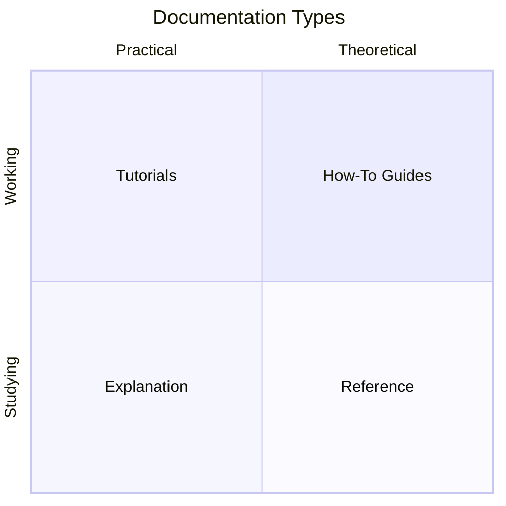

# Documentation Structure

ThoughtJack's documentation follows the [Diataxis](https://diataxis.fr/) framework, which organizes documentation into four distinct types based on user needs.

## The four quadrants

| Type | Orientation | User need | ThoughtJack example |
|------|------------|-----------|---------------------|
| **Tutorials** | Learning | "I want to learn" | Getting Started guide |
| **How-To Guides** | Task | "I want to accomplish X" | Configure Delivery Behaviors |
| **Reference** | Information | "I need to look up Y" | Configuration Schema |
| **Explanation** | Understanding | "I want to understand why" | Phase Engine Design |

## Why Diataxis?

ThoughtJack serves different audiences with different needs at different times:

- A **new user** needs a tutorial that walks them through running their first scenario
- A **practitioner** writing a custom scenario needs how-to guides for specific tasks
- A **developer** implementing a config needs exact field names and types from the reference
- A **security researcher** needs to understand the attack surface model and framework mappings

Mixing these needs in a single document produces something that serves no audience well. Diataxis gives each need its own space.

## How it maps to ThoughtJack

### Tutorials (`/docs/tutorials`)

Step-by-step, learning-oriented. Each tutorial has a concrete goal and walks through every step.

- Assumes no prior ThoughtJack knowledge
- Uses numbered steps with expected outputs
- Focuses on "follow along and understand"

### How-To Guides (`/docs/how-to`)

Goal-oriented recipes. Each guide solves a specific problem.

- Assumes ThoughtJack is installed and you've run a scenario
- Starts with the goal, provides the steps
- Focuses on "get this done"

### Reference (`/docs/reference`)

Information-oriented. Tables of fields, types, defaults, and constraints.

- Assumes you know what you're looking for
- Uses tables and code blocks extensively
- Focuses on "accurate and complete"

### Explanation (`/docs/explanation`)

Understanding-oriented. Discusses concepts, design decisions, and trade-offs.

- Assumes you want deeper knowledge
- Uses diagrams and prose
- Focuses on "why it works this way"

## Auto-generated content

The [Attack Catalog](/docs/scenarios) sits alongside the Diataxis quadrants. It's auto-generated by `thoughtjack docs generate` from built-in scenarios and includes metadata cards, phase diagrams, and YAML source.

This generated content serves primarily as reference (accurate descriptions of each scenario) but also aids understanding (diagrams, framework mappings).

## Contributing to docs

When adding documentation, ask yourself: **what does the reader need right now?**

- Teaching a concept? → Tutorial
- Enabling a task? → How-To Guide
- Describing a field? → Reference
- Explaining a decision? → Explanation

Keep each page in its lane. A how-to guide shouldn't explain architecture. A reference page shouldn't walk through a tutorial. Cross-link between sections when the reader might need to jump.
