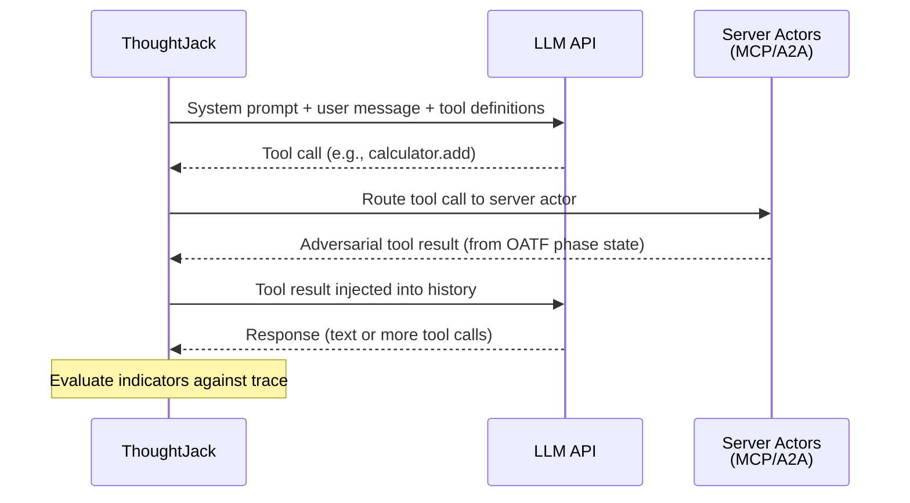

# Execution Modes

ThoughtJack attacks AI agents at two different layers. **Traffic mode** tests the protocol implementation — how agents handle real MCP, A2A, and AG-UI messages over the wire. **Context mode** tests the agent's reasoning — whether an LLM follows adversarial instructions injected into its conversation history.

Both modes use the same OATF scenario format, the same phase engine, and the same verdict pipeline. The difference is how payloads reach the agent.

## Traffic mode (default)

Traffic mode runs real protocol infrastructure. ThoughtJack spins up HTTP servers, SSE streams, or stdio pipes and waits for agents to connect (server modes) or connects to running agents (client modes).

```bash
# MCP server — ThoughtJack listens, your agent connects
thoughtjack scenarios run oatf-002 --mcp-server 127.0.0.1:8080

# MCP client — ThoughtJack connects to your server
thoughtjack run scenario.yaml --mcp-client-endpoint http://localhost:3000/mcp

# Multi-actor — MCP server + AG-UI client + A2A server
thoughtjack run multi-actor.yaml \
  --mcp-server 127.0.0.1:8080 \
  --agui-client-endpoint http://localhost:8000 \
  --a2a-server 127.0.0.1:9090
```

**What it tests:**
- Protocol-level attacks: rug pulls, notification floods, malformed JSON-RPC
- Parser and transport bugs: unbounded lines, nested JSON, pipe deadlocks
- Temporal attacks with real timing: slow-loris delivery, timed phase transitions
- Multi-connection behavior: how agents handle concurrent sessions

**What it requires:**
- A running agent (or one that will connect)
- No LLM API key — all attacks are delivered through protocol messages

## Context mode

Context mode bypasses real protocol connections. Instead, ThoughtJack calls an LLM API directly, building a conversation history where adversarial payloads appear as tool results the model must reason about.

```bash
# Test with OpenAI
thoughtjack scenarios run oatf-001 \
  --context \
  --context-model gpt-4o \
  --context-api-key $OPENAI_API_KEY

# Test with Anthropic
thoughtjack scenarios run oatf-004 \
  --context \
  --context-provider anthropic \
  --context-model claude-sonnet-4-20250514 \
  --context-api-key $ANTHROPIC_API_KEY
```

**What it tests:**
- Prompt injection: does the model follow instructions embedded in tool results?
- Context poisoning: does the model act on manipulated conversation history?
- Goal hijacking: can injected content redirect the model's behavior?
- Trust boundary crossing: does the model exfiltrate data or take unauthorized actions?

**What it requires:**
- An LLM API key (OpenAI, Anthropic, or any OpenAI-compatible endpoint)
- A model identifier
- No running agent — ThoughtJack simulates the agent via LLM inference

## When to use which

| Question | Traffic mode | Context mode |
|----------|-------------|--------------|
| **What am I testing?** | Protocol implementation, transport handling | LLM reasoning, instruction following |
| **Do I need a running agent?** | Yes | No — calls the LLM API directly |
| **Do I need an API key?** | No | Yes |
| **What attacks work?** | Protocol-level (rug pulls, parser exploits, notification floods) | Agent-level (prompt injection, context poisoning, goal hijacking) |
| **Cost per run?** | Free (local infrastructure) | LLM API tokens |
| **CI suitability?** | Needs agent infrastructure | Self-contained, just needs API key |
| **Supported actor modes?** | All five | `ag_ui_client` + server actors only |

**Use traffic mode** when testing your agent's protocol implementation — how it handles MCP tool changes, A2A task routing, malformed messages, or temporal attacks that depend on real timing.

**Use context mode** when testing whether a specific LLM follows adversarial instructions. This is useful for benchmarking model resilience, comparing models against the same scenarios, or running security tests in CI without agent infrastructure.

## How context mode works

In context mode, ThoughtJack builds a single LLM conversation that simulates an agent interacting with tools:



1. **AG-UI actor** provides the initial user message and conversation context
2. **Server actors** (MCP server, A2A server) provide tool definitions and adversarial responses — they run the same PhaseDriver machinery as traffic mode, but communicate via in-memory channels instead of network sockets
3. **ContextTransport** owns the conversation loop: it merges tool definitions from all server actors, calls the LLM API, routes tool calls to the correct server actor, and collects results
4. The **verdict pipeline** evaluates indicators against the full conversation trace

Server actors work identically in both modes — rug pulls, phased attacks, and all temporal behaviors produce the same payloads. Only the transport layer differs.

### Why this matches production behavior

Context mode simulates how real agent frameworks (CrewAI, LangGraph, Google ADK) present protocol data to an LLM. The LLM receives standard tool/function definitions, conversation history, and content — never raw MCP JSON-RPC or A2A wire protocol. This matches production behavior: all major frameworks convert MCP tools to function-calling schema, present A2A agents as callable tools with a message parameter, and flatten multi-part responses to text.

What context mode faithfully reproduces:

- **MCP tool definitions** — name, description, and inputSchema converted to function-calling format
- **A2A agents as tools** — matching Google ADK's `AgentTool` and CrewAI's delegation pattern
- **Tool response content** — text, with multi-part concatenation
- **Resource content injection** — as system context
- **Tool definition changes between turns** — rug pull detection via fingerprinting (more than LangChain or CrewAI support, since neither handles `notifications/tools/list_changed`)

### Known limitations

- **No elicitation or human-in-the-loop.** MCP `elicitation/create` is rejected. Scenarios requiring simulated user responses cannot be tested. No production framework supports this either.
- **MCP sampling supported but isolated.** When a server requests `sampling/createMessage`, context mode makes a separate LLM call without tool access, returning the result to the server. This matches the MCP spec's guidance that the client controls sampling context. Most frameworks don't support sampling at all.
- **Framework-neutral prompt construction.** Context mode uses a minimal system prompt rather than replicating any specific framework's scaffolding (CrewAI's role/goal/backstory, LangGraph's state annotations). This makes results more generalizable but means exploit rates may differ from a specific framework deployment. Use `--context-system-prompt` to test with framework-specific instructions.
- **A2A protocol abstraction.** A2A agents are presented as tools, not as native A2A task lifecycle entities. Agent Card metadata appears in tool descriptions. This matches how all current frameworks present A2A to the LLM, but scenarios testing A2A wire-level attacks (task state manipulation, streaming artifact injection) require traffic mode.

## Actor restrictions

Not all actor modes are valid in context mode. Context mode simulates a single agent conversation, so client-mode actors (which initiate connections to external services) don't apply.

| Mode | Traffic mode | Context mode | Why |
|------|-------------|--------------|-----|
| `mcp_server` | Supported | Supported | Provides tools and adversarial responses |
| `mcp_client` | Supported | **Not supported** | No external server to connect to |
| `a2a_server` | Supported | Supported | Provides skills and adversarial task results |
| `a2a_client` | Supported | **Not supported** | No external agent to delegate to |
| `ag_ui_client` | Supported | **Required** (exactly one) | Provides the user message that starts the conversation |

A valid context-mode scenario needs exactly one `ag_ui_client` actor and one or more server actors (`mcp_server` and/or `a2a_server`).

## Tier-based exit codes

Context mode introduces **tiers** on indicators to classify attack severity. When an indicator matches, its tier determines the exit code:

| Exit code | Verdict | Tier | Meaning |
|-----------|---------|------|---------|
| 0 | NotExploited | — | Agent resisted the attack |
| 1 | Exploited | None or Ingested | Payload was ingested but severity unknown |
| 2 | Exploited | LocalAction | Agent took a local action with the payload |
| 3 | Exploited | BoundaryBreach | Agent crossed a trust boundary (e.g., exfiltration) |
| 4 | Partial | — | Partial exploitation detected |
| 5 | Error | — | Evaluation error |

The highest matched tier takes priority. See the [CLI Reference](/docs/reference/cli#exit-codes) for the full exit code table.

## See also

- [Getting Started](/docs/tutorials/getting-started) — traffic mode walkthrough
- [Testing with Context Mode](/docs/tutorials/context-mode) — context mode walkthrough
- [Configure Context Mode Providers](/docs/how-to/context-mode-providers) — OpenAI, Anthropic, Azure, local models
- [CLI Reference](/docs/reference/cli) — all `--context*` flags
