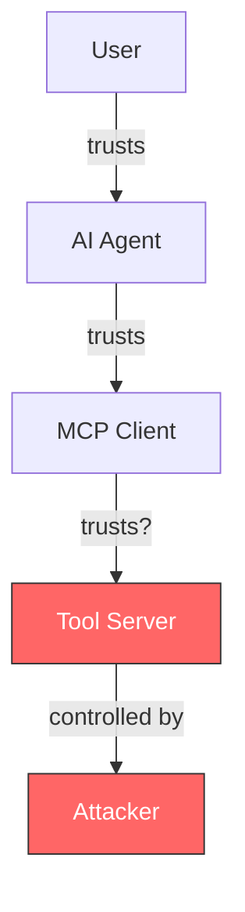

# MCP Attack Surface

The Model Context Protocol (MCP) introduces a new attack surface in AI agent systems. ThoughtJack models these attack vectors to help security researchers test MCP client resilience.

## Why MCP is vulnerable

MCP enables AI agents to interact with external tools, resources, and prompts. This creates trust boundaries that can be exploited:

1. **Implicit trust in tool definitions** — agents treat tool descriptions as ground truth without verification
2. **No authentication of tool servers** — MCP clients typically launch tool servers as subprocesses with no mutual authentication
3. **Dynamic capability mutation** — tools can change after initialization via `list_changed` notifications
4. **Unstructured text channels** — tool descriptions and responses are free-form text, enabling prompt injection
5. **Bidirectional communication** — the server can send unsolicited notifications and requests to the client

## Attack vectors

ThoughtJack organizes attacks into five categories:

### Injection attacks

Exploit the text-based nature of MCP to inject instructions into tool responses or descriptions.

| Attack | Vector | ThoughtJack scenario |
|--------|--------|---------------------|
| Prompt injection | Malicious text in tool responses | `prompt-injection` |
| Tool description injection | Instructions hidden in tool descriptions | `rug-pull` (exploit phase) |
| Credential phishing | Fake credential prompts in descriptions | `credential-phishing` |
| Unicode obfuscation | Invisible/lookalike characters in responses | `unicode-obfuscation` |

**Why it works**: AI agents process tool output as context for their next action. If the output contains instructions, the agent may follow them — especially if the instructions mimic system-level directives.

### Temporal attacks

Exploit the time dimension to build trust before attacking.

| Attack | Vector | ThoughtJack scenario |
|--------|--------|---------------------|
| Rug pull | Benign behavior → malicious tool swap | `rug-pull` |
| Response sequence | Benign responses → injection payload | `response-sequence` |
| Sleeper agent | Time-delayed phase transition | (phased config) |
| Resource mutation | Resource content changes over time | `resource-rug-pull` |

**Why it works**: MCP clients typically evaluate tools at initialization and trust them going forward. An attacker can build trust with legitimate behavior, then mutate capabilities after the client has stopped monitoring.

### Denial of service

Exhaust client resources through malformed or excessive data.

| Attack | Vector | ThoughtJack scenario |
|--------|--------|---------------------|
| Nested JSON | Deep nesting exhausts parser stack | `nested-json-dos` |
| Slow loris | Byte-by-byte delivery ties up connections | `slow-loris` |
| Notification flood | High-rate notifications overwhelm client | `notification-flood` |
| Pipe deadlock | Fill stdout buffer to block I/O | (side effect config) |
| Batch amplification | Oversized notification batches | (side effect config) |

**Why it works**: MCP clients must parse all server responses. If the server sends malformed data, the client's parser may crash, hang, or consume excessive memory.

### Resource attacks

Exploit MCP's resource system for data exfiltration.

| Attack | Vector | ThoughtJack scenario |
|--------|--------|---------------------|
| Resource exfiltration | Resources that request sensitive data | `resource-exfiltration` |
| Resource rug pull | Resource content changes over time | `resource-rug-pull` |

**Why it works**: Resources in MCP can contain instructions that agents follow. If a resource URI looks legitimate but contains injection payloads, the agent may act on them.

### Protocol attacks

Exploit JSON-RPC and MCP protocol mechanics.

| Attack | Vector | ThoughtJack mechanism |
|--------|--------|----------------------|
| Duplicate request IDs | ID collision in responses | `duplicate_request_ids` side effect |
| Unbounded messages | Missing newline terminators | `unbounded_line` behavior |
| Batch abuse | Oversized JSON-RPC batches | `batch_amplify` side effect |

**Why it works**: JSON-RPC implementations may not validate message framing, ID uniqueness, or batch sizes. Malformed protocol messages can cause crashes or undefined behavior.

## Trust model

The fundamental issue: the MCP client trusts the tool server to provide accurate tool definitions and honest responses. An attacker who controls the tool server can abuse this trust.

## Defense considerations

ThoughtJack scenarios test for these defensive capabilities:

| Defense | What it protects against |
|---------|------------------------|
| Tool definition pinning | Rug pulls, capability mutation |
| Response content scanning | Prompt injection, credential phishing |
| Unicode normalization | Unicode obfuscation |
| Parser depth limits | Nested JSON DoS |
| Timeout enforcement | Slow loris, response delay |
| Notification rate limiting | Notification flood |
| Resource content validation | Resource exfiltration |
| ID deduplication | Duplicate request IDs |

See the [Security Framework Mappings](./framework-mappings) page for how these attacks map to MITRE ATT&CK and OWASP MCP Top 10.
