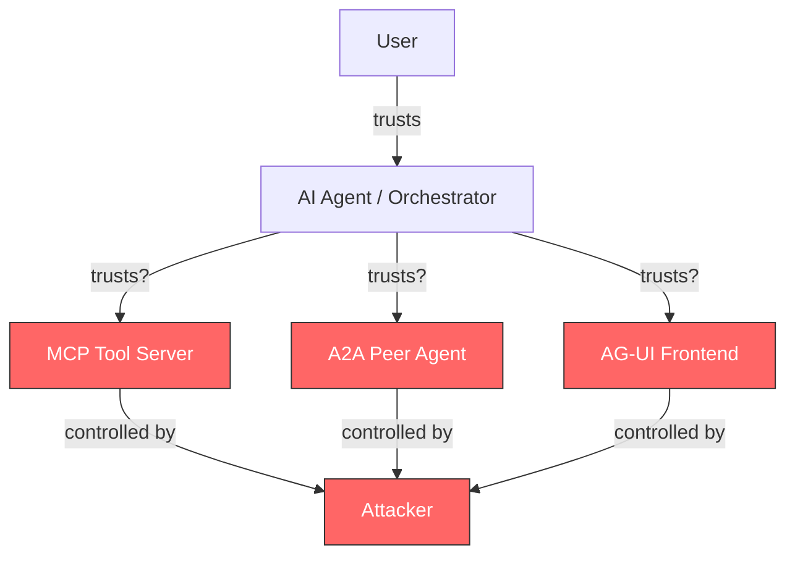

# Protocol Attack Surfaces

AI agent protocols — MCP, A2A, and AG-UI — each introduce distinct attack surfaces. ThoughtJack models these attack vectors to help security researchers test agent resilience across all three protocols.

## MCP attack surface

The Model Context Protocol (MCP) enables AI agents to interact with external tools, resources, and prompts. This creates trust boundaries that can be exploited:

1. **Implicit trust in tool definitions** — agents treat tool descriptions as ground truth without verification
2. **No authentication of tool servers** — MCP clients typically launch tool servers as subprocesses with no mutual authentication
3. **Dynamic capability mutation** — tools can change after initialization via `list_changed` notifications
4. **Unstructured text channels** — tool descriptions and responses are free-form text, enabling prompt injection
5. **Bidirectional communication** — the server can send unsolicited notifications and requests to the client

### MCP attack vectors

#### Injection attacks

Exploit the text-based nature of MCP to inject instructions into tool responses or descriptions.

| Attack | Vector | OATF scenario |
|--------|--------|--------------|
| Prompt injection | Malicious text in tool responses | OATF-004 |
| Tool description injection | Instructions hidden in tool descriptions | OATF-001 |
| Credential harvesting | Fake credential prompts in descriptions | OATF-006 |
| Goal hijacking | Tool output redirects agent objectives | OATF-010 |

**Why it works**: AI agents process tool output as context for their next action. If the output contains instructions, the agent may follow them — especially if the instructions mimic system-level directives.

#### Temporal attacks

Exploit the time dimension to build trust before attacking.

| Attack | Vector | OATF scenario |
|--------|--------|--------------|
| Rug pull | Benign behavior → malicious tool swap | OATF-002 |
| Tool shadowing | Override a legitimate tool's definition | OATF-003 |
| Sleeper agent | Time-delayed phase transition | (phased config) |
| Resource mutation | Resource content changes over time | (phased config) |

**Why it works**: MCP clients typically evaluate tools at initialization and trust them going forward. An attacker can build trust with legitimate behavior, then mutate capabilities after the client has stopped monitoring.

#### Denial of service

Exhaust client resources through malformed or excessive data.

| Attack | Vector | ThoughtJack mechanism |
|--------|--------|----------------------|
| Nested JSON | Deep nesting exhausts parser stack | `$generate: nested_json` |
| Slow loris | Byte-by-byte delivery ties up connections | `slow_loris` behavior |
| Notification flood | High-rate notifications overwhelm client | `notification_flood` side effect |
| Pipe deadlock | Fill stdout buffer to block I/O | `pipe_deadlock` side effect |

#### Protocol attacks

Exploit JSON-RPC and MCP protocol mechanics.

| Attack | Vector | ThoughtJack mechanism |
|--------|--------|----------------------|
| Duplicate request IDs | ID collision in responses | `duplicate_request_ids` side effect |
| Unbounded messages | Missing newline terminators | `unbounded_line` behavior |
| Batch abuse | Oversized JSON-RPC batches | `batch_amplify` side effect |

## A2A attack surface

The Agent-to-Agent (A2A) protocol enables agents to discover and delegate tasks to other agents. The self-declared nature of Agent Cards and lack of mandatory verification creates significant attack surface.

1. **Self-declared identity** — Agent Cards are JSON documents with no mandatory signing or central registry
2. **Capability advertising** — agents select peers based on advertised skills, which can be fabricated
3. **Cross-agent context flow** — task delegation passes context (including credentials) between agents
4. **No mutual authentication** — any entity can publish a convincing Agent Card

### A2A attack vectors

| Attack | Vector | OATF scenario |
|--------|--------|--------------|
| Agent Card spoofing | Impersonate a trusted agent via fake card | OATF-009 |
| Cross-agent prompt injection | Embed injection in Agent Card skill descriptions | OATF-008 |
| Task result poisoning | Return malicious content in task responses | (phased config) |
| Typosquatting | Register similar domain names to intercept delegation | OATF-009 |
| Trust delegation chain | Exploit transitive trust between agents | (multi-actor config) |

**Why it works**: Orchestrating agents select peers by matching task requirements against advertised Agent Card skills. An attacker who publishes a card with better-advertised capabilities (higher version, more skills, "enhanced security") can win task delegation over the legitimate agent.

## AG-UI attack surface

The Agent-User Interface (AG-UI) protocol connects frontend applications to AI agents via SSE streaming. Its bidirectional nature means client-side state flows directly into agent processing.

1. **Message list injection** — the `RunAgentInput` message list is the primary vector for prompt injection
2. **State manipulation** — client-side state updates flow directly into agent context
3. **No frontend trust boundary** — direct AG-UI exposure to untrusted clients is common
4. **SSE event stream** — the streaming protocol can be intercepted or manipulated

### AG-UI attack vectors

| Attack | Vector | OATF scenario |
|--------|--------|--------------|
| Message list injection | Fabricated messages in conversation history | OATF-011 |
| System message override | Inject system messages to override agent instructions | OATF-011 |
| Context fabrication | Insert fake assistant messages to create false context | OATF-011 |
| Tool call forgery | Simulate prior tool executions in message history | (phased config) |

**Why it works**: AG-UI agents process the entire message list as conversation context. If an attacker can inject messages — especially system messages or fabricated assistant responses — the agent treats them as legitimate conversation history.

## Cross-protocol attacks

Multi-actor OATF scenarios can test attacks that span protocol boundaries:

| Attack | Vector | OATF scenario |
|--------|--------|--------------|
| Goal hijacking | Tool output redirects agent to unrelated actions | OATF-010 |
| MCP↔A2A bridging | MCP tool response triggers A2A task delegation | (multi-actor config) |
| Supply chain | Compromise upstream tool server, affect downstream agents | OATF-007 |

These scenarios use OATF's multi-actor `execution.actors:` to run multiple protocol drivers concurrently, testing how agents handle adversarial inputs flowing across protocol boundaries.

## Trust model

```mermaid
graph TD
    User[User] -->|trusts| Agent[AI Agent / Orchestrator]
    Agent -->|trusts?| MCP[MCP Tool Server]
    Agent -->|trusts?| A2A[A2A Peer Agent]
    Agent -->|trusts?| AGUI[AG-UI Frontend]
    MCP -->|controlled by| Attacker[Attacker]
    A2A -->|controlled by| Attacker
    AGUI -->|controlled by| Attacker

    style MCP fill:#f66,stroke:#333,color:#fff
    style A2A fill:#f66,stroke:#333,color:#fff
    style AGUI fill:#f66,stroke:#333,color:#fff
    style Attacker fill:#f66,stroke:#333,color:#fff
```

The fundamental issue: AI agents trust their protocol peers to provide accurate information and honest responses. An attacker who controls any protocol endpoint can abuse this trust. ThoughtJack simulates controlled versions of each attack surface to test whether agents detect and resist manipulation.

## Defense considerations

ThoughtJack scenarios test for these defensive capabilities across protocols:

| Defense | Protects against | Protocol |
|---------|-----------------|----------|
| Tool definition pinning | Rug pulls, capability mutation | MCP |
| Response content scanning | Prompt injection, credential phishing | MCP, A2A |
| Unicode normalization | Unicode obfuscation | MCP, A2A |
| Parser depth limits | Nested JSON DoS | MCP |
| Timeout enforcement | Slow loris, response delay | MCP |
| Notification rate limiting | Notification flood | MCP |
| Agent Card verification | Card spoofing, impersonation | A2A |
| Skill description scanning | Cross-agent injection | A2A |
| Domain validation | Typosquatting | A2A |
| Message list validation | Message injection, context fabrication | AG-UI |
| Trusted frontend server | Direct client manipulation | AG-UI |
| ID deduplication | Duplicate request IDs | MCP |

See the [Security Framework Mappings](./framework-mappings) page for how these attacks map to MITRE ATT&CK, MITRE ATLAS, and OWASP.
