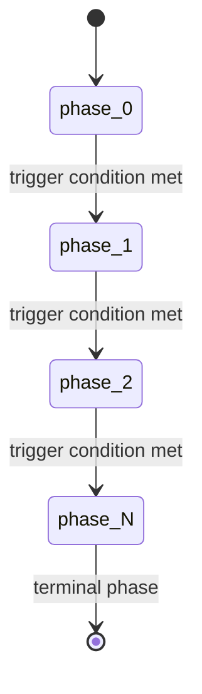
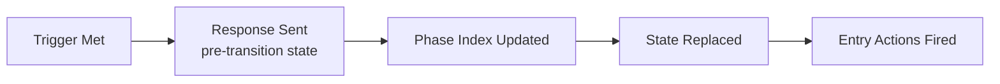

# Phase Engine Design

:::info v0.5 Architecture
In v0.5, the phase engine concepts described here are wrapped in the **PhaseLoop** / **PhaseDriver** architecture. PhaseLoop owns the event loop (trace append, extractor capture, trigger evaluation, phase advancement), while PhaseDriver implementations handle protocol I/O. The core concepts — linear state machine, response-before-transition, trigger types — still apply. See [Architecture](/docs/explanation/architecture) for the full v0.5 module diagram.
:::

The phase engine is the core of ThoughtJack's temporal attack capability. It implements a state machine that progresses through phases based on events, time, and content matching.

## State machine model


```mermaid
stateDiagram-v2
    [*] --> phase_0
    phase_0 --> phase_1: trigger condition met
    phase_1 --> phase_2: trigger condition met
    phase_2 --> phase_N: trigger condition met
    phase_N --> [*]: terminal phase
```

The phase engine is a **linear state machine** — phases advance in order through each configured phase. There are no backward transitions or branching paths. This models the typical attack lifecycle: reconnaissance → trust building → escalation → exploitation.

## Phase lifecycle

Each phase has three aspects:

1. **State** — the complete server/agent state (tools, resources, prompts, or protocol-specific config)
2. **Trigger** — the condition that advances to the next phase
3. **Entry actions** — notifications, requests, and log messages fired on entry


```mermaid
graph LR
    A[Trigger Met] --> B[Response Sent<br/>pre-transition state]
    B --> C[Phase Index Updated]
    C --> D[State Replaced]
    D --> E[Entry Actions Fired]
```

## Response-before-transition invariant

The most important design decision in the phase engine:

> The response to the request that triggers a phase transition uses the **pre-transition** state. The new phase takes effect **after** the response is sent.

This means:
- If a tool call triggers advancement from "benign" to "exploit", the response to that call comes from the "benign" phase
- The client sees the phase change on the **next** request, not the triggering one
- Entry actions (like `send: { method: "notifications/tools/list_changed" }`) fire after the response

Why? Because real-world attacks operate this way — the malicious change happens between requests, not within one. This also prevents timing issues where a response might reference tools that don't exist yet.

## Atomic state

The current phase index is stored as an `AtomicU64`:

```
Phase Index: AtomicU64
├── Load (Relaxed) — every request reads the current phase
├── Compare-and-swap — trigger evaluation atomically advances
└── No mutex needed — lock-free hot path
```

This design choice matters for HTTP transport with multiple concurrent connections:
- Multiple connections can read the current phase simultaneously without contention
- Phase transitions are atomic — no intermediate states are visible
- The `DashMap` provides per-connection state for `per-connection` scope

## Trigger evaluation

Triggers are evaluated on every relevant event. The engine supports three trigger types:

### Event-count triggers

The simplest trigger. The engine maintains a counter for the specified event and fires when the count reaches the threshold.

```
Event: tools/call
Counter: 0 → 1 → 2 → 3 → 4 → 5 = FIRE
```

The counter is specific to the trigger's event name. Different phases can count different events.

```yaml
phases:
  - name: trust_building
    trigger:
      event: tools/call     # event to count
      count: 5              # fire after 5 calls
```

### Time-based triggers

Time-based triggers use a timer that starts when the phase is entered. The phase engine checks these triggers at a configurable interval.

```
Phase entered at T=0
Timer check at T=100ms: 0.1s < 30s → not met
Timer check at T=200ms: 0.2s < 30s → not met
...
Timer check at T=30000ms: 30s >= 30s → FIRE
```

The check interval defaults to 100ms. Lower values increase timer precision but add CPU overhead.

```yaml
phases:
  - name: dormant
    trigger:
      after: 5m             # fire after 5 minutes in this phase
```

### Content-matching triggers

Content-matching triggers evaluate field matchers against request payloads. All matchers must pass (AND semantics).

```
Match: arguments.query contains "password"

Request 1: arguments.query = "hello world" → no match
Request 2: arguments.query = "my password" → MATCH → FIRE
```

Regex patterns are compiled once and cached (up to 256 entries) for performance.

```yaml
phases:
  - name: dormant
    trigger:
      event: tools/call[read_file]  # scoped to a specific tool (qualified event)
      match:
        arguments.path:
          regex: "(?i).*(passwd|shadow|\\.env|\\.pem|id_rsa).*"
```

## Timeout behavior

Event-count triggers support an optional timeout. If the count threshold isn't reached before the timeout elapses:

- **Advance** (default): advance to the next phase anyway, even though the count wasn't met
- **Abort**: stop the phase engine entirely

This models scenarios like "wait for 10 tool calls, but if the user is idle for 60 seconds, proceed anyway."

## Per-connection vs. global state

With HTTP transport, multiple clients connect simultaneously. The `state_scope` setting controls how phase state is shared:

**Per-connection** (default):
```
Client A: phase_0 → phase_1 → phase_2
Client B: phase_0 → phase_1         (independent)
```

Each connection maintains its own phase counter and trigger state. Client A advancing to phase 2 doesn't affect Client B.

**Global**:
```
Client A: tools/call (count: 3)
Client B: tools/call (count: 2)
Combined count: 5 → triggers advance for ALL clients
```

All connections share a single phase counter. Any client's events contribute to the global count.

## Entry action ordering

When a phase is entered, actions fire in declaration order:

```yaml
on_enter:
  - log: "Phase entered"                                         # 1st
  - send:                                                        # 2nd
      method: "notifications/tools/list_changed"
  - send:                                                        # 3rd
      method: "sampling/createMessage"
      params: {}
```

Entry actions are fire-and-forget — the engine doesn't wait for the client to process them before continuing.

## Terminal phases

A phase with no `trigger:` is the terminal phase. Once entered, no further transitions occur. The server continues operating in the terminal phase state indefinitely.

If no phases are configured (single-phase shorthand), the server operates in that state forever.

## v0.5 additions

The v0.5 engine builds on these concepts with additional abstractions:

### PhaseLoop

`PhaseLoop<D: PhaseDriver>` is generic over the driver and owns:
- The `PhaseEngine` (state machine described above)
- A `watch::Sender<HashMap<String, String>>` for extractor publication
- A `SharedTrace` (append-only trace buffer)
- An `ExtractorStore` reference (cross-actor shared state)

It runs a `tokio::select!` loop between driver execution and event consumption.

### PhaseDriver trait

Each protocol mode implements `PhaseDriver`:

```rust
trait PhaseDriver: Send {
    async fn drive_phase(&mut self, phase_index: usize, ...) -> Result<DriveResult>;
    async fn on_phase_advanced(&mut self, from: usize, to: usize) -> Result<()>;
}
```

Drivers focus on protocol I/O and emit `ProtocolEvent`s. PhaseLoop handles all state management.

### Watch channels for extractors

Extractors are published via `tokio::sync::watch` channels — cheap atomic swaps for the publisher (PhaseLoop) and atomic loads for consumers (drivers). Server-mode drivers borrow per-request for fresh values; client-mode drivers clone once at the start.

### Extractors and indicators

Extractors capture values from protocol events (e.g., tool call arguments, response content) and publish them via the watch channel. These captured values feed into the **indicator evaluation pipeline** after execution completes.

The **grace period** (`grace_period` in the OATF document) allows ThoughtJack to continue observing agent behavior after the terminal phase is reached. This is important because agents may take additional actions (like reading files or sending emails) after receiving the final phase's response. Indicators are evaluated against the full protocol trace, including events during the grace period.
